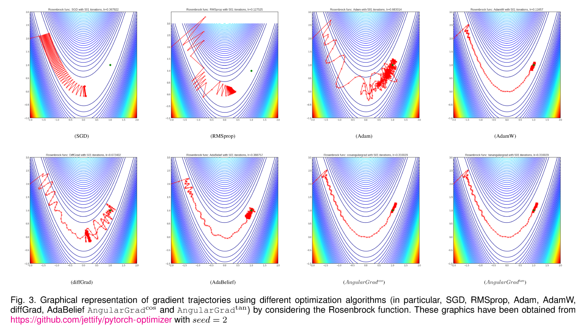

# AngularGrad Optimizer

This repository contains the oficial implementation for [AngularGrad: A New Optimization Technique for Angular Convergence of Convolutional Neural Networks](http://arxiv.org/abs/2105.10190) in PyTorch.

AngularGrad reduces the zig-zag effect in the optimization trajectory. Fluctuations are significantly smoothed, tracing a more direct path towards the minimum of the cost function.


If you have questions or suggestions, please feel free to open an issue. Please cite as:
```
@article{roy2021angulargrad,
  title={AngularGrad: A New Optimization Technique for Angular Convergence of Convolutional Neural Networks},
  author={S.K. Roy, M.E. Paoletti, J.M. Haut, S.R. Dubey, P. Kar, A. Plaza and B.B. Chaudhuri},
  journal={arXiv preprint arXiv:2105.10190},
  year={2021}
}
```
<p align="center">
 
</p>

In PyTorch:
```
optimizer = cosangulargrad(params, lr=1e-3, betas=(0.9, 0.999), eps=1e-8, weight_decay=0)
<or>
optimizer = tanangulargrad(params, lr=1e-3, betas=(0.9, 0.999), eps=1e-8, weight_decay=0)
Example:
optimizer = cosangulargrad(net.parameters())
```


## Experiments

Experiments in the paper:

Analitycal
```
cd analitycal/
python main.py
```

CIFAR-10/100
```
cd cifar/
python main.py --dataset <cifar10/cifar100> --model <r18/r34/.../vgg16/d121> --alg <adam/sgd/.../cosangulargrad/tanangulargrad> --lr <float>
Example:
python main.py --dataset cifar10 --model r50 --alg cosangulargrad --lr 1e-3
```

Mini-ImageNet:
```
cd mini-imagenet/
wget URL dataset
python main.py DATADIR --alg <adam/sgd/.../cosangulargrad/tanangulargrad> --lr <float>
Example:
python main.py ./split_mini/ --alg cosangulargrad --model r50 --lr 1e-3
```

Fine-Grained:
``` 
cd fine-grained/
wget URL datasets
python main.py DATADIR --dataset <dsetname> --alg <adam/sgd/.../cosangulargrad/tanangulargrad> --lr <float>
Example:
python main.py ./data/Car196/ --dataset cars --alg adam --lr 1e-3
```

